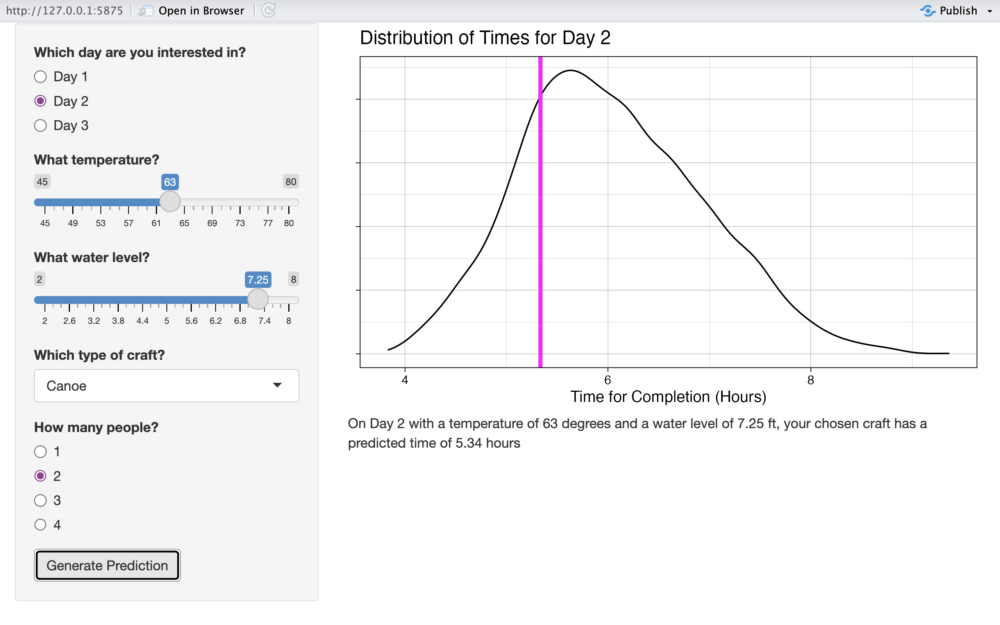

## Introduction

For this post, I worked with data related to the Adirondack Canoe Classic (90-Miler) race from 2008-2025. The data is separated between days of the three-day event; days 1 and 2 have 3722 results each and day 3 has 3293; for this post, I will be working with day 1. Race-specific finisher data is pulled from [PaddleStats](https://paddlestats.net/racehistory/ADK90), water level data comes from the [USGS](https://www.usgs.gov/), and weather data was gathered using [Open-Meteo](https://open-meteo.com/). The important variables (other than `year` which is used for organization) are `temp` (in Fahrenheit), `water` (water level in ft), `n_paddler` (# of paddlers), `boatType` (Canoe, Kayak, Guideboat, SUP, Voyageur), and `value` (time in hrs).

```{r}
#| output: FALSE
library(tidyverse)
library(broom)
theme_set(theme_linedraw())

day1 <- read.csv(here::here("day1_full.csv"))
```

In exploring this data set, I was interested in looking at any variables that could explain differences in completion times using these variables to build a model to predict future completion times.

## Exploring Variables

I began by looking closely at some variables to ensure they had relationships with completion times. Below is an exploratory plot showing the time distributions (as densities, not exact numbers) on day 1 of different boat types.

```{r}
ggplot(day1, aes(x = value, color = boatType)) +
  geom_density(linewidth = 0.9) +
  theme(axis.title.y = element_blank(), axis.text.y = element_blank()) +
  scale_color_viridis_d(option = "plasma") +
  labs(x = "Time (hr)",
       color = "Boat Type")
```

This plot supports my assumption that boat type will most likely be a helpful predictor for completion times. The boat types all have distinct peaks.

## Building The Model

The model I decided on uses `temp`, `level`, `boatType`, and `n_paddler` to predict `value`.

```{r}
pred_mod <- lm(value ~ boatType + temp + water + n_paddler, day1)
pred_mod |> summary()
```

This predictions are much more useful in context. The plot below shows, on the density plot of day 1 times, the model's prediction for a Canoe with 2 people on Day 1 with a temperature of 63 and a water level of 1706.8 ft.

```{r}
data <- data.frame(boatType = "Canoe", temp = 63, 
                   water = 1706.8, n_paddler = 2)

ggplot(data = day1, aes(x = value)) +
      geom_density() +
      geom_vline(xintercept = predict(pred_mod, data), 
                 color = "magenta", linewidth = 2) +
      theme_linedraw(base_size = 16) +
      theme(axis.title.y = element_blank(), 
            axis.text.y = element_blank()) +
      labs(x = "Time for Completion (Hours)",
           title = ("Distribution of Times for Day 1"))
```

We can see that this prediction—of about 7 hours—is just above the mode time for day 1. This makes sense, as canoes with 2 paddlers are extremely common boats and 63 degrees is an average temperature for day 1, but 1706.8 is on the higher end of water levels. A higher water level usually means faster times. This is reflected in the coefficient estimate for water level in the model summary.

## The App

Using this model, I built a Shiny App to make the model accessible to others. My Shiny App allows users to choose a day, a temperature, a water level, a craft type, and a number of paddlers (restricted to options with substantial data). As the water level measurements are from different locales with different scales, the slider for water level changes with the user's input for the day. Similarly, The user's input for craft type impacts the options available for number of paddlers.

Below is a screenshot from the Shiny App. The user has chosen a 2-person canoe on Day 2, with a temperature of 63 degrees and water level of 7.25 ft.



## Class Connections

For this blog post, I primarily made use of the Shiny section of the course. I worked with reactivity and dynamic UI to build the app I wanted. I revisited the Mastering Shiny book and consulted different chapters for topics such as the tabsetPanel(). I also made use of general visualization suggestions like removing unnecessary or confusing text and ensuring readability through text size.
